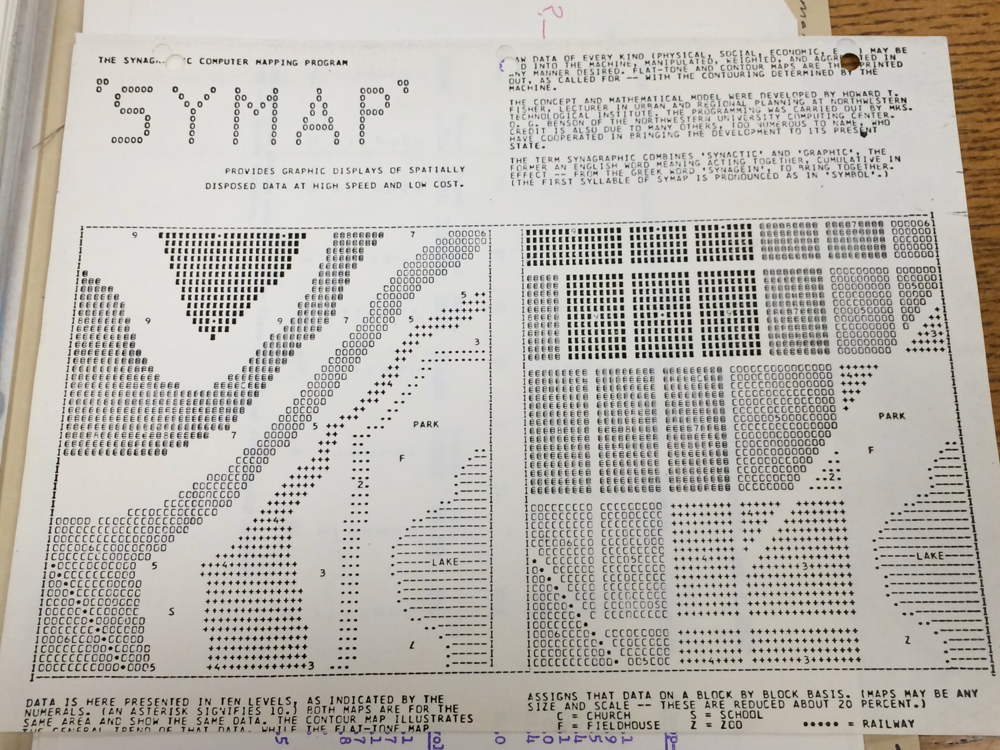
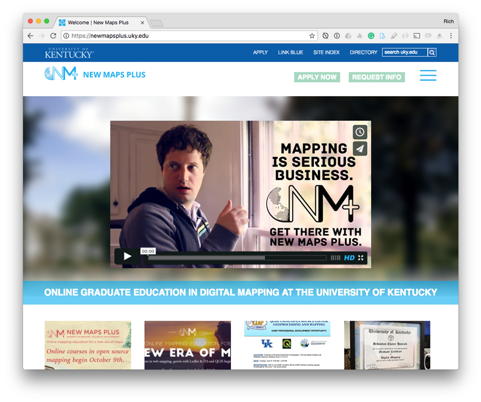
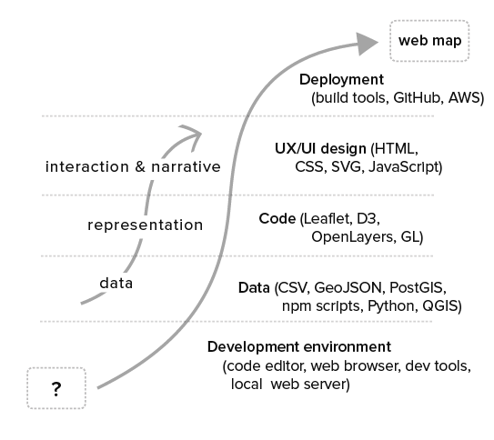
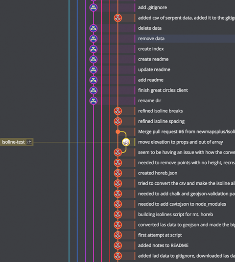
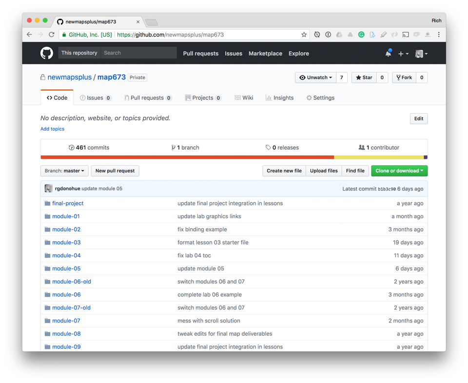
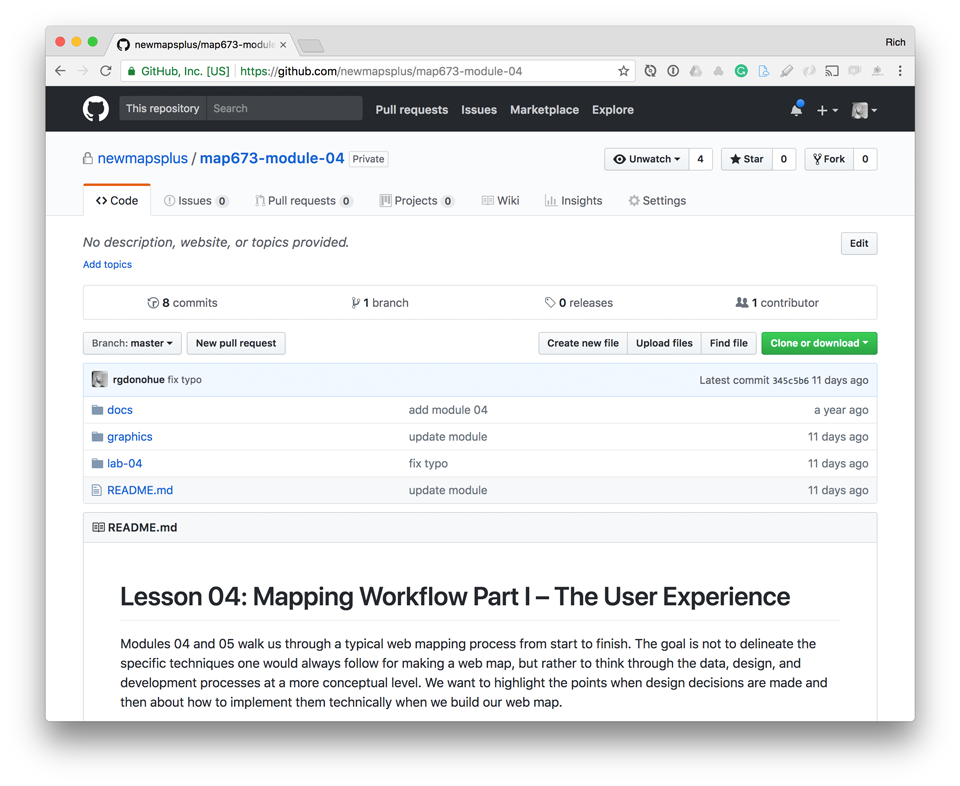
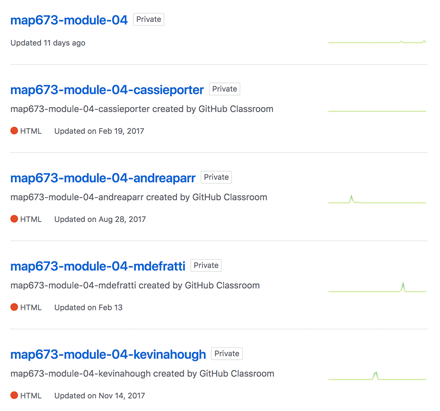

<!-- .slide: data-background-image="assets/images/dust_scratches.png" data-background-size="20% 20%" data-background-repeat="repeat" -->

# New maps in<br> the new medium

## Teaching web cartography<br> for a distributed workforce  
<br><br>
[Rich Donohue](https://twitter.com/rgdonohue)  
[Matthew W. Wilson](https://twitter.com/wilsonism)

---

## Rich Donohue

@div[left-40]

@divend

@div[right-60]
@ul
- PhD in Geography from the University of Wisconsin
- more stuff
- something funny
@ulend
@divend

---

## Matthew W. Wilson

@div[left-40]

@divend

@div[right-60]
@ul
- PhD in Geography from the University of Washington
- from a small town in northwest Missouri: Pumpkin Center
- new book [New Lines: Critical GIS and the Trouble of the Map](https://www.upress.umn.edu/book-division/books/new-lines)
- learned Markdown and Git for this presentation
- <i>and obviously not very well</i>
@ulend
@divend

---?image=assets/images/storytime.jpg

### Story time

---?image=assets/images/harvard-divinity.jpg

### Story time

---?image=assets/images/harvard-memorialhall.jpg

### Story time

---

### Story time

@div[left-50]
<br>

@divend

@div[right-50]

@divend

---

### Map produced from SYMAP?

---?image=assets/images/symap-map.png

### Map produced from SYMAP, ca. 1967

---?image=assets/images/symap-assignment.png

### Assignment from SYMAP<br> correspondence course, ca. 1967

---?image=assets/images/symap-coding-form.png

### SYMAP correspondence<br> coding form, ca. 1967

---?image=assets/images/nmp-website.png&size=auto

### [NewMapsPlus at the University of Kentucky](https://newmapsplus.uky.edu/)

---

### [NewMapsPlus at the University of Kentucky](https://newmapsplus.uky.edu/)

@div[right-60]

@divend

@div[left-40]
@ol
- began in Fall of 2015
- offers 12+ courses per year
- nearly 170 students have completed coursework
- 56 students have graduated with a certificate
- around a dozen more currently taking 'post-certificate' courses
@olend
@divend

---

### New Maps Plus learning objectives

<!-- .slide: data-background-image="assets/images/dust_scratches.png" data-background-size="20% 20%" data-background-repeat="repeat" -->

@div[right-60]

@divend

@div[left-40]
<br>
@ol
- apply traditional cartographic principles to web mapping
- employ open source tools for geospatial processing and data analysis tasks
- master web design and development using open standards to make maps
@olend
@divend

---?image=assets/images/tools.png&size=100% 90%

### Some of our favorite tools

---?image=assets/images/tools2.png&size=100% 90%

### What we're talking about today

@div[left-60]
@ul
- distributed version control system
- makes it impossible to lose information
- makes it impossible to retrieve information
@ulend
@divend

---

### Where this talk is heading?

@div[left-60]
<br>
@ol
- Using Git for course development and management
- How using Git improves the learning process
- The role Git in collaboration and community building
@olend
@divend

@div[right-40]

@divend

---

## Part I. How we use Git for<br> course development and management



---?image=assets/images/gitlogo.png&size=90% 90%

### But, wait: what is a 'Git'?

---

### Or: why use Git in the classroom?

@div[left-60]
<br>
@ol
- Classrooms are composed of little learning events
- Students receive feedback on their ability to demonstrate learning
- In a distributed, asynchronous classroom, Git provides a system for managing feedback, iteration, and documentation of learning 
@olend
@divend

@div[right-40]

@divend

---?image=assets/images/markdownlogo.png&size=90% 90%

### And, wait: we also write in 'Markdown'?

---

### And, wait: we also write in 'Markdown'?

@div[left-60]
<br>
@ol
- Students receive feedback from instructors in Markdown
- Students document their web map designs in Markdown
- Students evaluate other students' work, and the work of professionals, in Markdown
@olend
@divend

@div[right-40]

@divend

---

## Part I. How we use Git for<br> <b>course development</b> and management

@div[left-60]
<br>
@ol
- In the beginning, we didn't know what we were doing
- But that was a terrific way to start from scratch and make mistakes
- Decision was made to avoid proprietary formats for encoding information (Word, Google Docs, etc)
@olend
@divend

@div[right-40]

@divend

---

## Part I. How we use Git for<br> course development and <b>management</b>

---

### Node scripts used to automate course management tasks

```javascript
var markdownpdf = require("markdown-pdf"), 
    fs = require("fs")

fs.createReadStream("./syllabus.md")
    .pipe(markdownpdf({

    }))
.pipe(fs.createWriteStream("MAP_673_Syllabus.pdf"))

console.log('PDF syllabus written to file')
```


---

## Part II. How using Git improves<br> the learning process


---

### Highly recommended! Use GitHub Classroom


---?image=assets/images/starter-template.png&size=auto 100%

### Starter template for each course module

<!--  -->


---

### Student repos created from starter template

<!-- .slide: data-background-image="assets/images/dust_scratches.png" data-background-size="20% 20%" data-background-repeat="repeat" -->

@div[left-50]

@divend

@div[right-50]
<br>
@ul[icon-list]
- @fa[thumbs-up fa=5x fa-green] Repos are private and part of the NMP GitHub account
- @fa[thumbs-up fa=5x fa-green] Instructor already has admin and collaborative rights
- @fa[thumbs-down fa=4x fa-red] Module not hosted on student's account
- @fa[thumbs-down fa=4x fa-red] Difficult for student peers to help each other
@ulend
@divend

---

## Part III. How using Git promotes<br> collaboration and builds community

