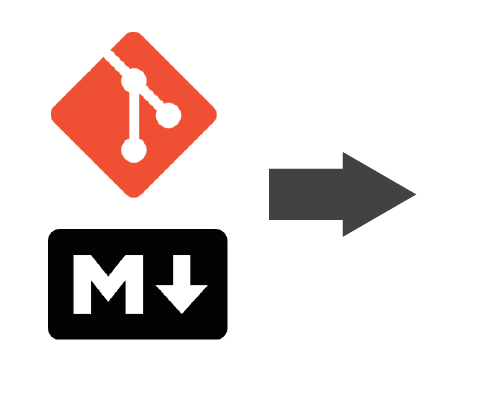
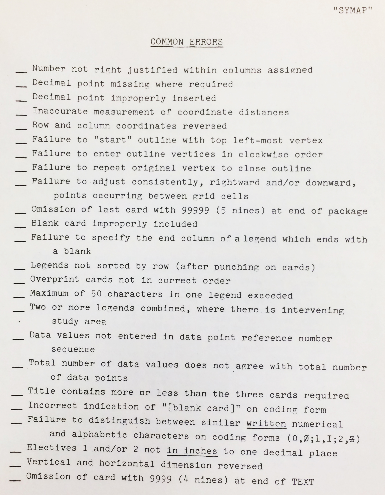

# New maps in<br> the new medium

## Teaching web cartography<br> for a distributed workforce  
<br><br>
[Rich Donohue](https://twitter.com/rgdonohue)  
[Matthew W. Wilson](https://twitter.com/wilsonism)

---

## Rich Donohue

@div[left-40]

@divend

@div[right-60]
@ul
- PhD in Geography from the University of Wisconsin-Madison
- teaches web cartography for New Maps Plus
- from a small town in SW Colorado
- recently relocated to East St. Louis
- would never eat a child
@ulend
@divend

---

## Matthew W. Wilson

@div[right-40]

@divend

@div[left-60]
@ul
- PhD in Geography from the University of Washington
- from a small town in northwest Missouri: Pumpkin Center
- new book [New Lines: Critical GIS and the Trouble of the Map](https://www.upress.umn.edu/book-division/books/new-lines)
- learned Markdown and Git for this presentation
- <i>and obviously not very well</i>
@ulend
@divend

---?image=assets/images/storytime.jpg

### Story time

---?image=assets/images/harvard-divinity.jpg

### Story time

---?image=assets/images/harvard-memorialhall.jpg

### Story time

---

### Story time: SYMAP?

---

### CARD MAPPING --> SYMAP

@div[left-50]
<br>
<br>
<br>

@divend

@div[right-50]

@divend

---?image=assets/images/symap-map.png

### Map produced from SYMAP, ca. 1967

---?image=assets/images/symap-assignment.png

### Assignment from SYMAP<br> correspondence course, ca. 1967

---?image=assets/images/symap-coding-form.png

### SYMAP correspondence<br> coding form, ca. 1967

---?image=assets/images/nmp-website.png&size=auto

### [New Maps Plus<br> at the University of Kentucky](https://newmapsplus.uky.edu/)

---

### [New Maps Plus<br> at the University of Kentucky](https://newmapsplus.uky.edu/)

@div[right-60]

@divend

@div[left-40]
@ul
- began in Fall of 2015
- offers 12+ courses per year
- nearly 170 students have completed coursework
- 56 students have graduated with a certificate
- around a dozen more currently taking 'post-certificate' courses
@ulend
@divend

---

### New Maps Plus learning objectives

@div[right-60]

@divend

@div[left-40]
<br>
@ol
- apply traditional cartographic principles to web mapping
- employ open source tools for geospatial processing and data analysis tasks
- master web design and development using open standards to make maps
@olend
@divend

---?image=assets/images/tools.png&size=auto

### Some of our favorite tools

---?image=assets/images/tools2.png&size=auto

### What we're talking about today

---?image=assets/images/tools2.png&size=auto

### What we're talking about today

@div[left-40]
<br>
**Wait, but what is Git?**
<br><br>
@ul
- distributed version control system
- open source de facto standard integrated with GitHub
- works well with text-based information like code and Markdown
@ulend
@divend

---?image=assets/images/tools2.png&size=auto

### What we're talking about today

@div[left-40]
<br>
**What is GitHub, then?**
<br><br>
@ul
- for-profit company hosting Git-enabled repositories
- provides additional web services (Issue tracking, project Wiki)
- offers (free) web-hosting ... great for student maps and portfolios!
@ulend
@divend

---?image=assets/images/tools2.png&size=auto

### What we're talking about today

@div[left-40]
<br>
**Okay, and what is Markdown?**
<br><br>
@ul
- lightweight syntax written in plain text
- used for rendering text content, images, code snippets, and URLs in a web document
@ulend
@divend

---

### Where this talk is heading?

@div[left-60]
<br>
@ol
- Using Git and Markdown for course development and management
- How using Git improves the learning process
- The role Git in collaboration and community building
@olend
@divend

@div[right-40]

@divend

---?layout:center

## Part I. How we use Git and Markdown for<br> <b>course development</b> and management

@div[left-50]

@divend

@div[right-50]

@divend

---?image=assets/images/course-master-repo.png&size=80% auto

### All content created in a<br> course "master" repo

---?image=assets/images/course-module-repo.png&size=80% auto

### Individual modules contain drafts of lessons, labs, and solutions

---?image=assets/images/lesson-readme.png&size=80% auto

### Lessons are written<br> using Markdown

---?image=assets/images/lesson-solution.png&size=80% auto

### Repositories hold all files, data

---?image=assets/images/lesson-dev-tracked.png&size=80% auto

### And changes in content<br> are tracked through Git

---

### If we want to get fancy, npm and Node scripts are used to automate course management tasks

```javascript
const markdownpdf = require("markdown-pdf");
const fs = require("fs");

// read course syllabus in Markdown
fs.createReadStream("./syllabus.md")
    .pipe(markdownpdf())

    // create PDF version to file with Uni bureaucracy 
    .pipe(fs.createWriteStream("MAP_673_Syllabus.pdf"));
```
---
#### Using Git and Markdown<br> for course management?

@div[left-40]

@divend

@div[right-60]
@ul[icon-list]
- @fa[thumbs-up fa=5x fa-green] centralized workflow for course creation and maintence
- @fa[thumbs-up fa=5x fa-green] easy to share course repo with other schools/instructors (builds community)
- @fa[thumbs-up fa=5x fa-green] format for writing and editing content ready for course deployment
- @fa[thumbs-down fa=4x fa-red] using Git is complicated
- @fa[thumbs-down fa=4x fa-red] is difficult getting faculty buy-in
- @fa[thumbs-down fa=4x fa-red] doesn't do much for Geospatial data stored as binary
@ulend
@divend

---

## Part II. How using Git improves<br> the learning process


---?image=assets/images/github-classroom.png&size=90% 90%

### Highly recommended:<br> Use GitHub Classroom!

---?image=assets/images/starter-template.png&size=80% auto

### Starter template for each<br> course module


---

### Student repos created<br> from starter template

@div[left-50]

@divend

@div[right-50]
<br>
@ul[icon-list]
- @fa[thumbs-up fa=5x fa-green] Repos are private and part of the NMP GitHub account
- @fa[thumbs-up fa=5x fa-green] Instructor already has admin and collaborative rights
- @fa[thumbs-down fa=4x fa-red] Module not hosted on student's account
- @fa[thumbs-down fa=4x fa-red] Difficult for student peers to help each other
@ulend
@divend

---

## Part III. How using Git promotes<br> collaboration and builds community


---

## Some conclusions...

Your mileage may vary.

---?image=assets/images/computer.jpg&size=90% 90%

### Intentionality

---?image=assets/images/computer.jpg&size=90% 90%

### Intentionality

@div[right-40]

@divend

@div[left-60]
<br>
@ol
- Then and now: educators must be intentional in choosing tools and platforms to support learning
- Then and now: students should be immersed in an environment where errors are opportunities for learning
- Then and now: there is always more to learn
@olend
@divend

<!-- EXTRA STUFF -->

---

### Why use Git in the classroom?

@div[left-60]
<br>
@ol
- Classrooms are composed of little learning events
- Students receive feedback on their ability to demonstrate learning
- In a distributed, asynchronous classroom, Git provides a system for managing feedback, iteration, and documentation of learning 
@olend
@divend

---

### And, wait: we also write in 'Markdown'?

@div[left-60]
<br>
@ol
- Students receive feedback from instructors in Markdown
- Students document their web map designs in Markdown
- Students evaluate other students' work, and the work of professionals, in Markdown
@olend
@divend

@div[right-40]

@divend